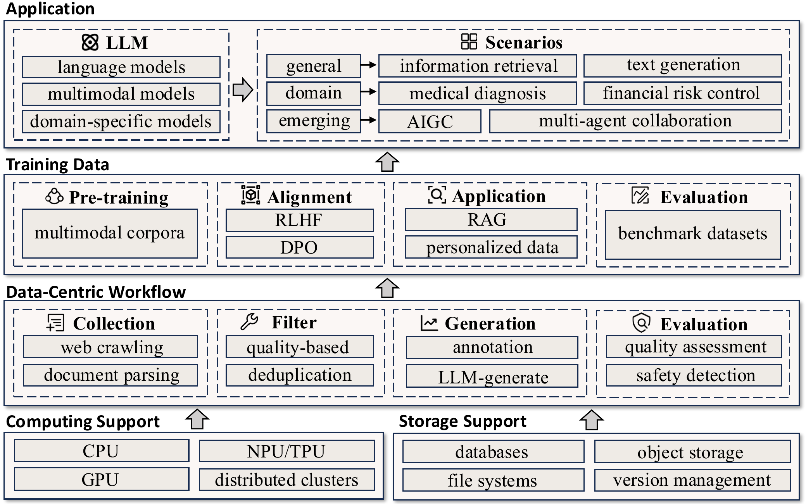
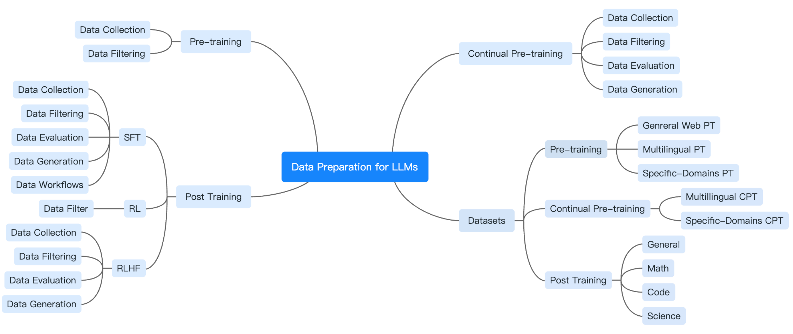

<div align="center">

# Awesome LLM Data Preparation

<!-- TODO: export assets/cover.pdf -> assets/cover.png (e.g. `pdftoppm -png -r 220 assets/cover.pdf assets/cover`) and replace the line below.
     GitHub Markdown does NOT render PDFs inline. -->
<!--  -->

**A curated survey of *Data Preparation for Large Language Models* — from Pre-training to Continual Pre-training to Post-training.**

*Turn raw text into training-ready signals: collect → filter → generate → evaluate.*

<p>
  <a href="https://github.com/haolpku/Awesome-LLM-Data-Preparation/stargazers"></a>
  <a href="https://github.com/haolpku/Awesome-LLM-Data-Preparation/network/members"></a>
  <a href="https://github.com/haolpku/Awesome-LLM-Data-Preparation/issues"></a>
  <a href="https://github.com/haolpku/Awesome-LLM-Data-Preparation/pulls"></a>
  <a href="https://github.com/haolpku/Awesome-LLM-Data-Preparation/blob/main/LICENSE"></a>
  <a href="https://awesome.re"></a>
</p>

<p>
  
  
  
  
  
  
</p>

<p>
  <b>
    <a href="#-why-this-repo">Why</a> ·
    <a href="#-taxonomy-at-a-glance">Taxonomy</a> ·
    <a href="#-pre-training-data-preparation">Pre-training</a> ·
    <a href="#-continual-pre-training-data-preparation">CPT</a> ·
    <a href="#-post-training-data-preparation">Post-training</a> ·
    <a href="#-datasets">Datasets</a> ·
    <a href="#-contributing">Contribute</a> ·
    <a href="#-citation">Cite</a>
  </b>
</p>

<p>
  <a href="./README_zh.md">🇨🇳 中文版 README</a> ·
  <a href="./papers/pre-training.md">📘 Pre-training papers</a> ·
  <a href="./papers/continual-pre-training.md">📗 CPT papers</a> ·
  <a href="./papers/post-training.md">📙 Post-training papers</a> ·
  <a href="./papers/datasets.md">📚 Dataset index</a>
</p>

</div>

---

## 🔥 News

- **2025.10** — v0.1 of this repository released, accompanying the survey *"Data Preparation for Large Language Models"* (JCST, under review).
- **2025.10** — Paper preprint: _coming soon_. <!-- TODO: replace with arXiv link and add the badge below. -->
  <!-- [](https://arxiv.org/abs/XXXX.XXXXX) -->
- We welcome **PRs** of new papers, datasets, and workflows — see [Contributing](#-contributing). ⭐ Star this repo to get updates as the field moves.

---

## 💡 Why this repo?

LLMs are moving from a **model-centric** era to a **data-centric** era. Architectural tricks compound, but *data quality, coverage, and preparation workflows* are increasingly the bottleneck to capability, safety, and compute efficiency.

There are many great papers about LLM training, but far fewer that treat **data preparation itself** as a first-class subject. This repository accompanies our survey and aims to:

1. **Organize the zoo** — give you a taxonomy that cleanly separates *operators* (dedup, filter, score, rephrase, …) from *workflows* (how they compose into FineWeb / Dolma / OpenMathInstruct / Infinity-Instruct style pipelines).
2. **Be practical** — every paper links to code / dataset / HF cards where possible, so you can jump from reading to training.
3. **Stay current** — the field moves monthly; PRs are encouraged and reviewed quickly.
4. **Lower the barrier** — if you are a newcomer, the three stage-specific pages (Pre-train / CPT / Post-train) let you ramp up in an afternoon.

> 💬 **If this repo saves you time, please give it a ⭐ — it is the single biggest signal for us to keep maintaining it.**

---

## 🗺️ Taxonomy at a glance

<!-- TODO: export assets/structure.pdf -> assets/structure.png and replace the placeholder below. -->
<!-- <p align="center"></p> -->

We organize the field along two axes:

- **Training stage**: Pre-training → Continual Pre-training → Post-training (SFT / RL / RLHF).
- **Data operation**: Collection → Filtering → Generation → Evaluation → Workflow.

| Stage | Typical scale | Per-sample cost | Dominant filtering style | Primary goal |
|---|---|---|---|---|
| **Pre-training (PT)** | 10⁹ – 10¹² tokens | Low | Heuristic + scalable | Broad coverage & diversity |
| **Continual Pre-training (CPT)** | 10⁷ – 10⁹ tokens | Medium | Hybrid | Freshness & domain adaptation |
| **Post-training (SFT/RLHF)** | 10³ – 10⁶ samples | High | Fine-grained, strict | Alignment & task skill |

**Rule of thumb from the literature.** Coarse-to-fine pipelines win: cheap rule-based filters remove the obviously-bad, then model-based operators concentrate compute on the valuable remainder. Pre-training favors throughput; post-training favors per-sample quality.

---

## 📖 Table of Contents

- [Why this repo?](#-why-this-repo)
- [Taxonomy at a glance](#️-taxonomy-at-a-glance)
- [Pre-training Data Preparation](#-pre-training-data-preparation)
  - [Data Collection](#data-collection-pt)
  - [Data Filtering](#data-filtering-pt)
  - [Deduplication](#deduplication)
- [Continual Pre-training Data Preparation](#-continual-pre-training-data-preparation)
- [Post-training Data Preparation](#-post-training-data-preparation)
  - [SFT](#sft)
  - [RL with Verifiable Rewards](#rl-with-verifiable-rewards)
  - [RLHF / RLAIF](#rlhf--rlaif)
- [Datasets](#-datasets)
- [Data Preparation Systems & Tooling](#-data-preparation-systems--tooling)
- [Related Surveys](#-related-surveys)
- [Contributing](#-contributing)
- [Citation](#-citation)
- [Star History](#-star-history)
- [Authors & Contact](#-authors--contact)

---

## 🧱 Pre-training Data Preparation

> Full list with annotations: [`papers/pre-training.md`](./papers/pre-training.md)

Pre-training data preparation has moved through three recognizable eras:

<blockquote>
<b>Scale-Oriented Crawling</b> (2019–2021) → <b>Reproducibility-Oriented Mixtures</b> (2022–2024) → <b>Capability-Oriented Enrichment</b> (2024–now).
</blockquote>

The narrative: *"collect everything"* → *"curate responsibly and transparently"* → *"target capabilities and domains, with licensing/contamination in mind."*

### Data Collection (PT)

<details open>
<summary><b>Scale-Oriented Crawling</b> — trillions of tokens from Common Crawl</summary>

- **CCNet** — *CCNet: Extracting High Quality Monolingual Datasets from Web Crawl Data* (LREC 2020). [[paper]](https://arxiv.org/abs/1911.00359) [[code]](https://github.com/facebookresearch/cc_net)
- **WebText** — *Language Models are Unsupervised Multitask Learners* (2019). [[paper]](https://cdn.openai.com/better-language-models/language_models_are_unsupervised_multitask_learners.pdf)
- **C4** — *Exploring the Limits of Transfer Learning with a Unified Text-to-Text Transformer* (JMLR 2020). [[paper]](https://arxiv.org/abs/1910.10683) [[dataset]](https://huggingface.co/datasets/allenai/c4)
- **ClueWeb22** — *ClueWeb22: 10 Billion Web Documents with Visual and Semantic Information* (2022). [[paper]](https://arxiv.org/abs/2211.15848)
- **CulturaX** — 6.3T tokens, 167 languages. [[paper]](https://arxiv.org/abs/2309.09400) [[dataset]](https://huggingface.co/datasets/uonlp/CulturaX)
- **GlotCC** — Multilingual web corpus with broad language coverage (2024). [[paper]](https://arxiv.org/abs/2410.23825)

</details>

<details open>
<summary><b>Reproducibility-Oriented Mixtures</b> — open recipes, ablations, licensing</summary>

- **RedPajama-Data v2** — 80+ CC snapshots, 40+ quality signals. [[blog]](https://together.ai/blog/redpajama-data-v2) [[dataset]](https://huggingface.co/datasets/togethercomputer/RedPajama-Data-V2)
- **Dolma** — 3T-token open corpus + modular toolkit (AllenAI, 2024). [[paper]](https://arxiv.org/abs/2402.00159) [[dataset]](https://huggingface.co/datasets/allenai/dolma)
- **FineWeb / FineWeb-Edu** — lightweight scalable filters, strong knowledge/reasoning gains (2024). [[paper]](https://arxiv.org/abs/2406.17557) [[dataset]](https://huggingface.co/datasets/HuggingFaceFW/fineweb)
- **Common Corpus** — permissively-licensed, trillion-token scale (2025).
- **DataComp-LM (DCLM)** — 240T-token standardized corpus + recipes + benchmarks (2024). [[paper]](https://arxiv.org/abs/2406.11794)
- **The Pile** — 22 curated sources (EleutherAI, 2020). [[paper]](https://arxiv.org/abs/2101.00027)

</details>

<details open>
<summary><b>Capability-Oriented Enrichment</b> — domain- and skill-targeted corpora</summary>

- **The Stack v2 / StarCoder2** — 600+ programming languages. [[paper]](https://arxiv.org/abs/2402.19173) [[dataset]](https://huggingface.co/datasets/bigcode/the-stack-v2)
- **OpenWebMath** — LaTeX-preserving math web corpus. [[paper]](https://arxiv.org/abs/2310.06786) [[dataset]](https://huggingface.co/datasets/open-web-math/open-web-math)
- **OpenMathInstruct-2** — large problem–solution pairs (2024). [[paper]](https://arxiv.org/abs/2410.01560)
- **MegaMath** — 371B math tokens blending web, code, synthetic (2025).
- **PMC-LLaMA / Me-LLaMA / Biomed-Enriched** — biomedical corpora with LLM-guided selection.

</details>

### Data Filtering (PT)

Four axes: **sensitive/harmful content**, **bias & fairness**, **redundancy & contamination**, and **language/format/quality**.

- **PII detection & toxicity.** Regex + dictionaries → NER (Presidio, spaCy, WikiPII-trained BERT) → classifier models (fastText, BERT toxicity, Perspective API). See WanJuan-CC, ROOTS, PanGu-α.
- **Debiasing corpora.** Counterfactual Data Augmentation/Substitution (Zhao et al. 2018; Dinan 2019; Barikeri RedditBias 2021), trigger-phrase LM scoring (Ngo et al. 2021).
- **Deduplication.**
  - *Exact:* MD5/SHA hashing, Bloom filters (CCNet, Dolma, RedPajama-V2), `EXACTSUBSTR` suffix arrays ([Lee et al. 2021](https://arxiv.org/abs/2107.06499)).
  - *Fuzzy:* **MinHash-LSH** (GPT-3, The Pile, Gopher, RefinedWeb, SlimPajama, RedPajama-V2), **SimHash** (RedPajama-1T), TLSH (OSCAR), TF-IDF (TigerBot), Levenshtein (PaLM code).
  - *Recent:* **SoftDedup** (soft reweighting, 2024), **LSHBloom** (web-scale, 2024), **Mosaic Memory** (limits of near-dup dedup, 2024).
  - *Model-based:* **SemDeDup** (OPT/CLIP + k-means), **D4** (centroid pruning), Noise-Robust bi-encoder retrieval + cross-encoder re-rank, **GenDedup** (keyword-prediction memorization signal).
- **Contamination checks.** 13-gram (GPT-3), 8-gram ≥70% (PaLM), 10+ token overlap (LLaMA-2).
- **Language / format / quality.** fastText-LID / CLD3 / langid.py; Trafilatura / Boilerpipe for extraction; perplexity (KenLM) and classifier-based scoring (GPT-3 binary quality, **Ultra-FineWeb**, **FinerWeb-10BT**, **JQL** — multilingual LLM-as-judge across 35 languages, **QuaDMix** — quality-diversity joint optimization).

### Deduplication

We split dedup out because it matters for *every* stage. See the dedicated section in [`papers/pre-training.md#deduplication`](./papers/pre-training.md#deduplication) for an annotated taxonomy.

---

## 🔄 Continual Pre-training Data Preparation

> Full list: [`papers/continual-pre-training.md`](./papers/continual-pre-training.md)

CPT sits between base pre-training and fine-tuning. The defining constraint: **inject new knowledge (domain, language, time) without catastrophic forgetting.**

- **Domain-specific corpora.** FinPythia-6.9B (finance), Japanese financial CPT, PMC-LLaMA (biomedical), Me-LLaMA (129B biomedical tokens + instructions).
- **Language coverage.** 120B-token Portuguese CPT, **Glot500**, **EMMA-500** (MaLA, 546 languages), **Sailor**, **AURORA-M** (435B tokens, 2-stage, human-red-teamed safety).
- **Temporal freshness.** **TemporalWiki** (incremental Wiki diffs), **Nemotron-CC v2** (multi-snapshot CC + LLM rephrasing, 6.6T tokens), **NeuScraper** (neural web scraping).
- **Filtering.** Long-range attention dependency (**LADM**) for long-context CPT; genre/domain classifiers; model-informed filtering with near-converged checkpoints (Ultra-FineWeb).
- **Evaluation.** Similarity-based corpus scoring, domain-ordering effects on curriculum (Yildiz et al. 2024), proxy-model validation (Wang et al. 2025, Chen et al. 2024, AstroMLab-2 for scientific CPT).
- **Generation.** Raw-text reformatting (WRAP, YuLan-Mini, Phi-4 style conversion), reasoning augmentation (**Reasoning CPT**, **EntiGraph**, **MIND**), domain expansion (**TRAIT**, **MachineLearningLM**, AstroMLab).

---

## 🎯 Post-training Data Preparation

> Full list: [`papers/post-training.md`](./papers/post-training.md)

### SFT

**Data Collection.** Existing NLP corpora (FLAN, T0, LIMA's StackExchange/wikiHow), manually-constructed (Free Dolly, Open-Assistant, Aya, OL-CC), and LLM-generated (Vicuna/ShareGPT, Instruction Wild, **WebR**, **BARE** dual-model).

**Data Filtering.** Shared-with-PT filters plus task-specific methods: **Repairity** (low-quality reasoning trace removal), step-wise error-rate filtering ([He et al. 2025](https://arxiv.org/abs/2502.12104)), **TFP** (threshold-based packing).

**Data Evaluation / Selection.**
- *Coreset-based:* k-center, submodular (Kothawade et al., Wei et al.), sensitivity-based importance, **D3** & **Influence** data selection.
- *LLM-based:* **GPTScore**, **MoDS**, **SelectLLM**, **Self-Refine**, reasoning-trace evaluation.
- *Gradient-based:* **EL2U**, **LESS**, **LoGra** (low-rank), **QLESS** (quantized gradients).
- *Self-instruction-based:* **IFD / Quantity→Quality**, **One-Shot / Cherry**, **Active Instruction Tuning**, **SelectIT** (token/sentence/model score).

**Data Generation (by task).**
- *Generation & creative:* CNN-DailyMail, XSum, Reddit writing prompts.
- *QA & IE:* SQuAD, Natural Questions, TriviaQA, **InstructUIE**.
- *Reasoning:* CoT, GSM8K, MATH, HumanEval, MBPP, **PAL**, **PoT**, **BiRM**, **Diverse CoT**.
- *NLU/Classification:* **FLAN**, **T0**, zero-shot generalization analyses.
- *Dialogue:* ShareGPT, Vicuna, **InstructGPT**.

**SFT Workflows.**
1. **Corpus-to-Instruction** — NLP datasets → template conversion → filters → large structured SFT set.
2. **Human / Crowdsourced** — manual prompts → adjudication → small high-quality set.
3. **LLM-Synthetic** — seed → LLM expansion (Self-Instruct, WizardLM, InstructSkillMix, GLAN) → filters.
4. **Dialogue / Process-Supervision** — multi-turn logs → role tagging → process supervision → safety redaction.
5. **Unified systems** — e.g. [**DataFlow**](https://github.com/OpenDCAI/DataFlow) (composable operators + automated pipelines).

### RL with Verifiable Rewards

- **Offline difficulty filtering.** Sample *k* rollouts, keep prompts with pass-rate in [0.2, 0.8]. Used widely in **DAPO** and similar RLVR setups.
- **Online difficulty filtering.** Track on-the-fly pass rate per prompt under **GRPO** (DeepSeekMath, DeepSeek-R1); **[Bae et al. 2025](https://arxiv.org/abs/2504.03380)** show balanced mid-band filtering gives up to +10pp on AIME over plain GRPO.
- **Verifiable rewards.** Boxed answers, unit tests, compile/run checks, symbolic verifiers.

### RLHF / RLAIF

- **Collection.** Pairwise / ranked preferences; critique-and-revision natural-language feedback ([Jin et al. 2023](https://arxiv.org/abs/2309.14317)); hybrid with proxy-model signals.
- **Filtering.** Inter-annotator agreement, calibration with gold samples, margin-based filtering, hard-case targeting (**RL-THF**).
- **Evaluation.** **RewardBench**, intra-trajectory consistency (**IC-RM**), hierarchical (**ALaRM**), RM-quality impact studies (*the Elephant*).
- **AI-Feedback generation.** **Constitutional AI**, **RLAIF** (incl. d-RLAIF), **Self-Rewarding LM**, LLM-as-a-judge reliability (pairwise, rubric-grounded, multi-judge aggregation).

---

## 📚 Datasets

> Full dataset index with links: [`papers/datasets.md`](./papers/datasets.md)

### Pre-training & CPT — selected

| Dataset | Domain | Size | Year | Stage |
|---|---|---|---|---|
| [FineWeb](https://huggingface.co/datasets/HuggingFaceFW/fineweb) | General / Web | ~18.5T tokens | 2024 | PT |
| [RefinedWeb](https://huggingface.co/datasets/tiiuae/falcon-refinedweb) | General / Web | 600B tokens | 2023 | PT |
| [RedPajama-Data-1T](https://huggingface.co/datasets/togethercomputer/RedPajama-Data-1T) | LLaMA-style mix | ~1.2T tokens | 2023 | PT |
| [The Pile](https://pile.eleuther.ai/) | General / English | ~825 GiB | 2020 | PT |
| [C4](https://huggingface.co/datasets/allenai/c4) | General / Web | ~807 GiB | 2019 | PT |
| [ROOTS (BigScience)](https://huggingface.co/bigscience-data) | Multilingual (59) | 1.6 TB | 2022 | PT |
| [CulturaX](https://huggingface.co/datasets/uonlp/CulturaX) | Multilingual (167) | 6.3T tokens | 2023 | PT |
| [HPLT v2](https://hplt-project.org/datasets/v2.0) | Multilingual (193) | ~8T tokens | 2025 | PT |
| [Dolma](https://huggingface.co/datasets/allenai/dolma) | Mixed | 3T tokens | 2023 | PT |
| [The Stack v2](https://huggingface.co/datasets/bigcode/the-stack-v2) | Code | ~900B tokens | 2024 | PT |
| [OpenWebMath](https://huggingface.co/datasets/open-web-math/open-web-math) | Math | 14.7B tokens | 2023 | PT |
| [EMMA-500 / MaLA](https://huggingface.co/collections/MaLA-LM/mala-corpus-66e05127641a51de34d39529) | 546 langs | >74B tokens | 2024–25 | CPT |
| [AURORA-M](https://huggingface.co/aurora-m/datasets) | Multilingual + Code | 435B tokens | 2024 | CPT |
| [Nemotron-CC v2](https://huggingface.co/datasets/nvidia/Nemotron-CC-v2) | General / Web | ~6.586T tokens | 2025 | PT/CPT |
| [Nemotron-MIND](https://huggingface.co/datasets/nvidia/Nemotron-MIND) | Math | >138B tokens | 2025 | CPT |
| [YuLan-Mini](https://huggingface.co/datasets/yulan-team/YuLan-Mini-Datasets) | Code/Math/Sci | 1.08T tokens | 2024–25 | PT |
| [MegaMath-Web-Pro-Max](https://huggingface.co/datasets/OctoThinker/MegaMath-Web-Pro-Max) | Math | 69.2M rows | 2025 | CPT |

### Post-training — selected

| Dataset | Domain | Size | Year | Stage |
|---|---|---|---|---|
| [Infinity-Instruct](https://huggingface.co/datasets/BAAI/Infinity-Instruct) | Instruction & Chat | 7.4M + 1.5M | 2025 | SFT |
| [OpenHermes 2.5](https://huggingface.co/datasets/teknium/OpenHermes-2.5) | Instruction & Chat | ~1.0M | 2024 | SFT |
| [ShareGPT](https://huggingface.co/datasets/RyokoAI/ShareGPT52K) | Dialogue | ~90K | 2023 | SFT/RLHF |
| [OpenMathInstruct-2](https://huggingface.co/datasets/nvidia/OpenMathInstruct-2) | Math / Instruct | 14M pairs | 2024 | SFT |
| [NuminaMath-CoT](https://huggingface.co/datasets/AI-MO/NuminaMath-CoT) | Math / Reasoning | ~860K | 2024 | SFT |
| [Omni-MATH](https://huggingface.co/datasets/KbsdJames/Omni-MATH) | Math / Benchmark | 4,428 | 2024 | Eval |
| [SYNTHETIC-1](https://huggingface.co/datasets/PrimeIntellect/SYNTHETIC-1) | General Reasoning | ≥1.4M | 2025 | SFT |
| [EpiCoder-func-380k](https://huggingface.co/datasets/microsoft/EpiCoder-func-380k) | Code / Function | 380K | 2025 | SFT |
| [KodCode-V1](https://huggingface.co/datasets/KodCode/KodCode-V1) | Code / Instruct+RL | 487K | 2025 | SFT/RLHF |
| [SWE-bench Verified](https://huggingface.co/datasets/princeton-nlp/SWE-bench_Verified) | Software Eng. | 500 | 2024 | Eval |
| [ScienceQA](https://scienceqa.github.io/) | Science QA | 21,208 | 2022 | Eval/SFT |
| [ToolBench](https://github.com/OpenBMB/ToolBench) | Tool-Use | 16K+ APIs | 2023 | SFT |
| [WebWalkerQA](https://huggingface.co/datasets/callanwu/WebWalkerQA) | Web Agent | 680 QAs | 2025 | Eval |

### Starter kit (what we recommend running first)

1. One general corpus — **FineWeb** or **RedPajama-V2**.
2. One reproducible mixture — **DCLM** or **HPLTv2**.
3. One specialized set — **OpenWebMath** or **The Stack v2**.
4. One CPT refresh — **Nemotron-CC v2** or **AURORA-M**.
5. One SFT set + one reasoning set + one verifiable code set — e.g. **Infinity-Instruct** + **OpenMathInstruct-2** + **KodCode-V1**.
6. Benchmarks for iterating — **Omni-MATH**, **SWE-bench Verified**, **ScienceQA**.

---

## 🛠 Data Preparation Systems & Tooling

- [**DataFlow**](https://github.com/OpenDCAI/DataFlow) — composable operators for the full data lifecycle (ours).
- [**Data-Juicer**](https://github.com/modelscope/data-juicer) — extensible data processing for LLMs.
- [**NeMo Curator**](https://github.com/NVIDIA/NeMo-Curator) — GPU-accelerated, web-scale curation.
- [**Dolma Toolkit**](https://github.com/allenai/dolma) — modular pipeline used to build the Dolma corpus.
- [**MinerU**](https://github.com/opendatalab/MinerU) — PDF → Markdown/JSON with layout & OCR, preserves math/code/tables.
- [**FED (GPU-accelerated fuzzy dedup)**](https://github.com/NVIDIA/NeMo-Curator) — trillions-of-tokens dedup.
- [**Trafilatura**](https://github.com/adbar/trafilatura) / [**Boilerpipe**](https://github.com/kohlschutter/boilerpipe) — robust boilerplate removal & extraction.
- [**Presidio**](https://github.com/microsoft/presidio) — PII detection / anonymization.

---

## 📎 Related Surveys

- Bai et al., *Survey on multimodal data preparation*, 2024.
- Zha et al., *Data-Centric AI: Perspectives and Challenges*, 2023/2025.
- Zhou et al., *A Survey on Data-Centric LLMs*, 2025.
- Wang et al., *Data management for LLMs*, 2023.
- Liu et al., *Datasets for LLMs: A Survey*, 2024.
- *Data preparation for fine-tuning*, 2025.

See [`papers/surveys.md`](./papers/surveys.md) for annotations and pointers.

---

## 🤝 Contributing

We enthusiastically welcome community contributions — this is a living list.

**Fastest path:**
1. Open an **Issue** using the [*Add a paper*](./.github/ISSUE_TEMPLATE/add-paper.yml) template — paste the title, year, venue, and one-line contribution. We will add it.
2. Or open a **PR** editing the right file in [`papers/`](./papers). See [`CONTRIBUTING.md`](./CONTRIBUTING.md) for the 30-second format.

Please be specific about *which data preparation operator/stage* a new paper belongs to — that is what makes this list more useful than a generic LLM list.

---

## 📄 Citation

If this survey or repository helps your research, please cite:

```bibtex
@article{liang2025dataprep,
  title   = {Data Preparation for Large Language Models},
  author  = {Liang, Hao and Wong, Zhen Hao and Liu, Ruitong and Wang, Yuhan and
             Qiang, Meiyi and Zhao, Zhengyang and Shen, Chengyu and He, Conghui and
             Zhang, Wentao and Cui, Bin},
  journal = {Journal of Computer Science and Technology (JCST)},
  year    = {2025},
  note    = {Survey}
}
```

<!-- TODO: once the arXiv preprint is out, add a second BibTeX entry here with the arXiv id. -->

---

## 📈 Star History

<a href="https://star-history.com/#haolpku/Awesome-LLM-Data-Preparation&Date">
  <picture>
    <source media="(prefers-color-scheme: dark)" srcset="https://api.star-history.com/svg?repos=haolpku/Awesome-LLM-Data-Preparation&type=Date&theme=dark" />
    <source media="(prefers-color-scheme: light)" srcset="https://api.star-history.com/svg?repos=haolpku/Awesome-LLM-Data-Preparation&type=Date" />
    
  </picture>
</a>

---

## 👥 Authors & Contact

This repository accompanies the JCST survey. Authors are with **Peking University**, **Beijing Zhongguancun Academy**, and **Shanghai AI Laboratory**.

- **Hao Liang** (梁昊) — hao.liang@stu.pku.edu.cn
- **Zhen Hao Wong** (黄钲浩) — zhenhao1141@stu.pku.edu.cn
- **Ruitong Liu** (刘芮彤), **Yuhan Wang** (王宇涵), **Meiyi Qiang** (强美伊), **Zhengyang Zhao** (赵正阳), **Chengyu Shen** (申程宇)
- **Conghui He** (何聪辉), Shanghai AI Laboratory
- **Wentao Zhang** (张文涛) — wentao.zhang@pku.edu.cn
- **Bin Cui** (崔斌), corresponding author — bin.cui@pku.edu.cn

> Found a bug, a missing paper, or a broken link? [Open an issue](../../issues) — we read them all.

---

<div align="center">

**If this repository helps you, please consider giving it a ⭐ — that is how we know to keep shipping updates.**

*Last updated: 2025-10. Maintained by the authors of the JCST survey.*

</div>
